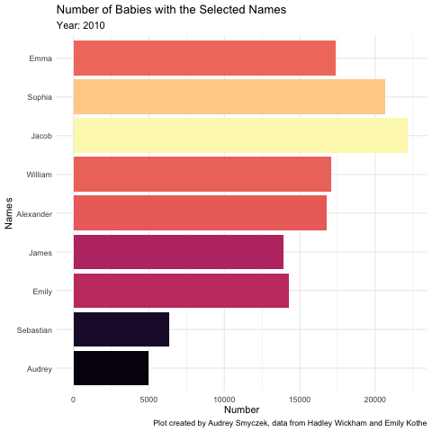

```{r setup, include=FALSE}
knitr::opts_chunk$set(echo = TRUE, error=TRUE, message=FALSE, warning=FALSE)
```

```{r libraries}
library(tidyverse)     # for graphing and data cleaning
library(lubridate)     # for date manipulation
library(ggthemes)      # for even more plotting themes
library(gganimate)     # for adding animation layers to ggplots
library(viridis)
theme_set(theme_minimal()) # My favorite ggplot() theme :)
```

## Data choice 1: Baby Names

```{r}
babynames <- readr::read_csv('https://raw.githubusercontent.com/rfordatascience/tidytuesday/master/data/2022/2022-03-22/babynames.csv')
```

This week's data should be familiar from previous exercises. There is data for both babynames from New Zealand and the US. Read more about it, including definitions of variables, [here](https://github.com/rfordatascience/tidytuesday/blob/master/data/2022/2022-03-22/readme.md). 

```{r, eval=FALSE}
new_baby <- babynames %>% 
  select(`year`, `name`, `n`) %>% 
  filter(year > 2009,
         name %in% c("William", "James", "Emily", "Sophia", "Alexander", "Jacob", "Emma", "Audrey", "Sebastian")) %>% 
  group_by(name, year) %>% 
  mutate(n = sum(n)) %>% 
  distinct() %>% 
  arrange(n) %>% 
  ungroup()

babyname_over_time <-
  new_baby %>% 
  ggplot(aes(x = n, y = reorder(name, n))) +
  geom_col(aes(fill = n))+
  labs(title = "Number of Babies with the Selected Names",
       subtitle = "Year: {closest_state}",
       x = "Number",
       y = "Names",
       caption = "Plot created by Audrey Smyczek, data from Hadley Wickham and Emily Kothe")+
  theme(legend.position = "none")+
  scale_fill_viridis_c(option = "magma")+
  transition_states(year)

anim_save("babynames_over_time.gif",
          animation = babyname_over_time)
```

```{r, fig.alt= "Animated horizonal bar graph which shows the number of babies named from 2010 to 2017. The graph contains 9 names with Emma having the greatest number for most years. The number of names is indicated on the x-axis and the color of the bars."}

```

